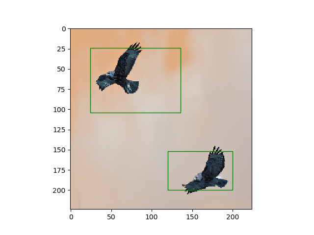
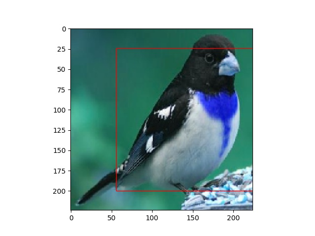

# Mining-Objects
Mining Objects: Fully Unsupervised Object Discovery and Localization From a Single Image
https://arxiv.org/pdf/1902.09968.pdf

Not implemented fully :/ But working :)

# How to Use
```
python run.py path_to_img
```

# Results

<p align="center">
  
  
</p>
